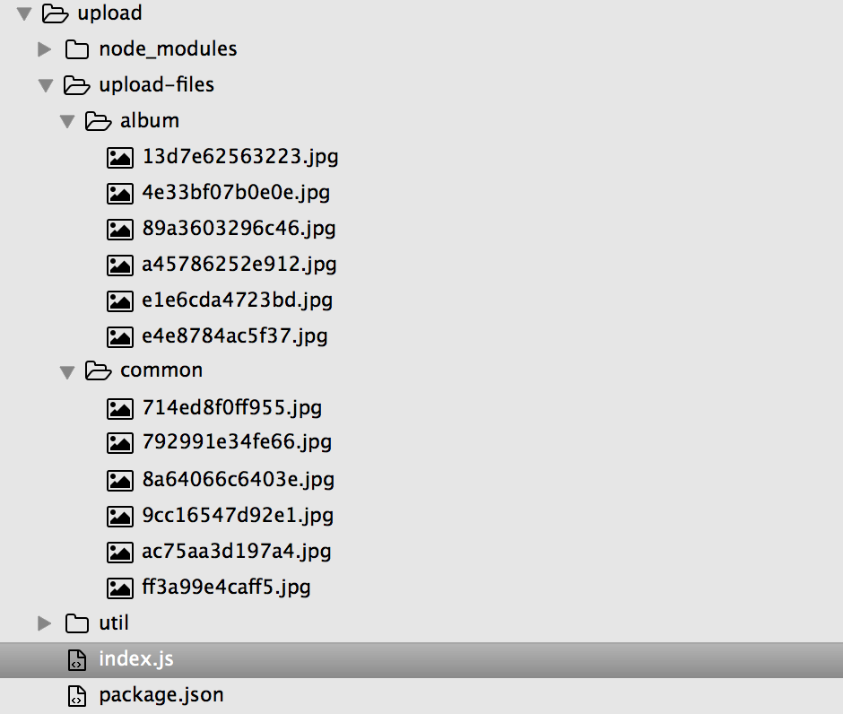

# 上传文件简单实现

## 依赖模块

### 安装依赖

```sh
npm install --save busboy
```

- busboy 是用来解析出请求中文件流

## 例子源码

demo源码

[https://github.com/ChenShenhai/koa2-note/blob/master/demo/upload/](https://github.com/ChenShenhai/koa2-note/blob/master/demo/upload/)

### 封装上传文件到写入服务的方法

```js
const inspect = require('util').inspect
const path = require('path')
const os = require('os')
const fs = require('fs')
const Busboy = require('busboy')

/**
 * 同步创建文件目录
 * @param  {string} dirname 目录绝对地址
 * @return {boolean}        创建目录结果
 */
function mkdirsSync( dirname ) {
  if (fs.existsSync( dirname )) {
    return true
  } else {
    if (mkdirsSync( path.dirname(dirname)) ) {
      fs.mkdirSync( dirname )
      return true
    }
  }
}

/**
 * 获取上传文件的后缀名
 * @param  {string} fileName 获取上传文件的后缀名
 * @return {string}          文件后缀名
 */
function getSuffixName( fileName ) {
  let nameList = fileName.split('.')
  return nameList[nameList.length - 1]
}

/**
 * 上传文件
 * @param  {object} ctx     koa上下文
 * @param  {object} options 文件上传参数 fileType文件类型， path文件存放路径
 * @return {promise}         
 */
function uploadFile( ctx, options) {
  let req = ctx.req
  let res = ctx.res
  let busboy = new Busboy({headers: req.headers})

  // 获取类型
  let fileType = options.fileType || 'common'
  let filePath = path.join( options.path,  fileType)
  let mkdirResult = mkdirsSync( filePath )
  
  return new Promise((resolve, reject) => {
    console.log('文件上传中...')
    let result = { 
      success: false
    }

    // 解析请求文件事件
    busboy.on('file', function(fieldname, file, filename, encoding, mimetype) {
      let fileName = Math.random().toString(16).substr(2) + '.' + getSuffixName(filename)
      let _uploadFilePath = path.join( filePath, fileName )
      let saveTo = path.join(_uploadFilePath)

      // 文件保存到制定路径
      file.pipe(fs.createWriteStream(saveTo))

      // 文件写入事件结束
      file.on('end', function() {
        result.success = true
        result.message = '文件上传成功'

        console.log('文件上传成功！')
        resolve(result)
      })
    })

    // 解析结束事件
    busboy.on('finish', function( ) {
      console.log('文件上结束')
      resolve(result)
    })

    // 解析错误事件
    busboy.on('error', function(err) {
      console.log('文件上出错')
      reject(result)
    })

    req.pipe(busboy)
  })
    
} 


module.exports =  {
  uploadFile
}
```

### 入口文件
```js
const Koa = require('koa')
const path = require('path')
const app = new Koa()
// const bodyParser = require('koa-bodyparser')

const { uploadFile } = require('./util/upload')

// app.use(bodyParser())

app.use( async ( ctx ) => {

  if ( ctx.url === '/' && ctx.method === 'GET' ) {
    // 当GET请求时候返回表单页面
    let html = `
      <h1>koa2 upload demo</h1>
      <form method="POST" action="/upload.json" enctype="multipart/form-data">
        <p>file upload</p>
        <input name="file" type="file" /><br/><br/>
        <button type="submit">submit</button>
      </form>
    `
    ctx.body = html

  } else if ( ctx.url === '/upload.json' && ctx.method === 'POST' ) {
    // 上传文件请求处理
    let result = { success: false }
    let serverFilePath = path.join( __dirname, 'upload-files' )

    // 上传文件事件
    result = await uploadFile( ctx, {
      fileType: 'album', // common or album
      path: serverFilePath
    })

    ctx.body = result
  } else {
    // 其他请求显示404
    ctx.body = '<h1>404！！！ o(╯□╰)o</h1>'
  }
})

app.listen(3000)
console.log('[demo] upload-simple is starting at port 3000')
```

### 运行结果




